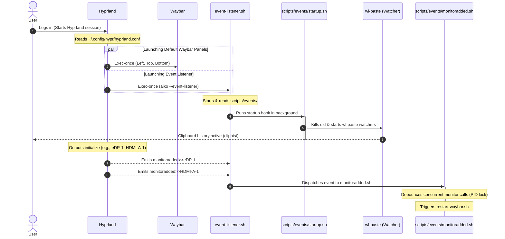
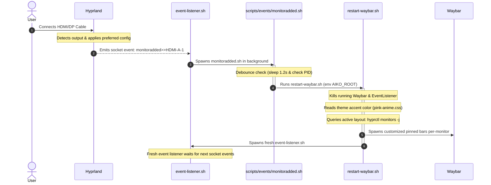

# System Events Lifecycle Flow

This document details how the global event listener and the system layout handle two critical scenarios:
1. **System Startup / PC Restart**
2. **Monitor Hotplugging (Connecting a 2nd or 3rd display)**

---

## 1. System Startup / PC Restart Flow

When you turn on or restart the PC, the boot process loads your display manager, which launches Hyprland. Below is the step-by-step lifecycle flow:

### Detailed Breakdown:
1. **Hyprland Initialization**: Hyprland loads user configuration (`hyprland.conf`) which contains `exec-once` lines.
2. **Waybar & Listener Launch**: Hyprland launches default Waybar panels and `aiko --event-listener` concurrently.
3. **Startup Hook**: `event-listener.sh` runs `scripts/events/startup.sh` in the background, which cleans up any old wl-paste processes and spawns new ones to watch text and image clipboards.
4. **Initial Display Configuration**: Hyprland configures active outputs and sends `monitoradded` events through the socket.
5. **Auto-Alignment**: The listener processes these events, spawning `monitoradded.sh` which debounces and triggers a Waybar restart (`restart-waybar.sh`) to align panels dynamically based on physical layout and orientation (portrait vs landscape).

---

## 2. Monitor Hotplug / Connection Flow

When you plug in an external monitor (or dock a laptop with multiple screens), the system configures the layout in real-time:

### Detailed Breakdown:
1. **Connection**: The user plugs in a display. Hyprland detects it and enables it according to the rule `monitor = , preferred, auto, 1`.
2. **Event Emission**: Hyprland broadcasts `monitoradded>>HDMI-A-1` through `socket2.sock`.
3. **Dispatch**: The global `event-listener.sh` intercepts the event and runs the handler `scripts/events/monitoradded.sh` asynchronously.
4. **Debounce (PID Check)**:
   - To prevent multiple concurrent restarts (e.g. if a dock reports 2 screens instantly), `monitoradded.sh` writes its PID to `/tmp/aiko-monitor-restart-trigger` and sleeps for `1.2` seconds.
   - If another handler instance runs during this window, it overrides the PID, causing the older instance to terminate quietly.
   - Only the latest instance executes the restart script.
5. **Re-Layout**:
   - `restart-waybar.sh` kills existing panels and listener processes.
   - It queries all active displays (`hyprctl monitors -j`), generates pinned configuration shims based on portrait/landscape orientation, applies wallpaper, and starts Waybars.
   - It spawns a fresh `event-listener.sh` to await future events.
